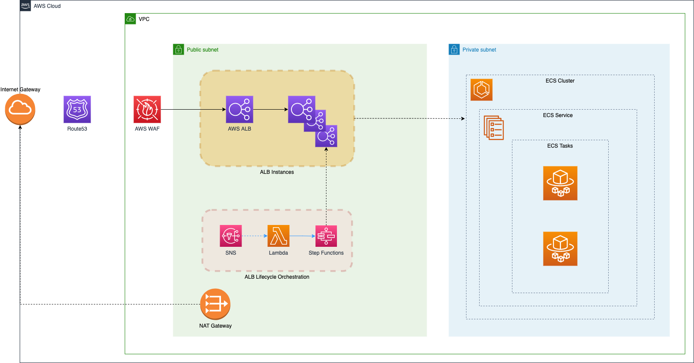
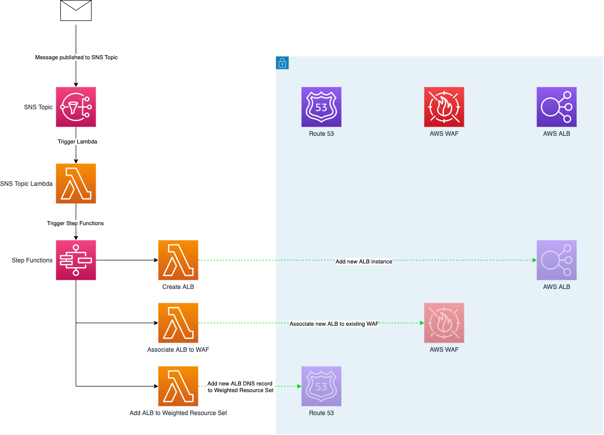
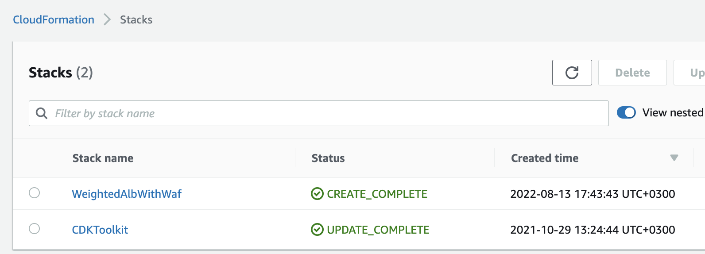
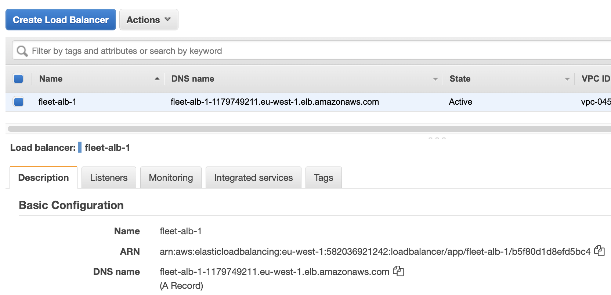
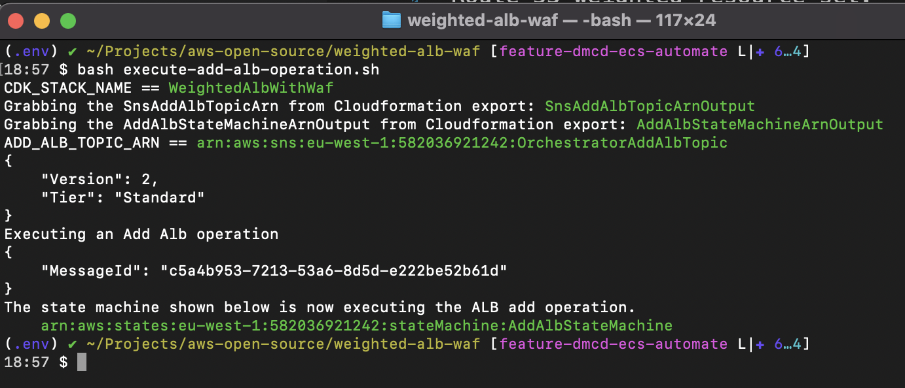
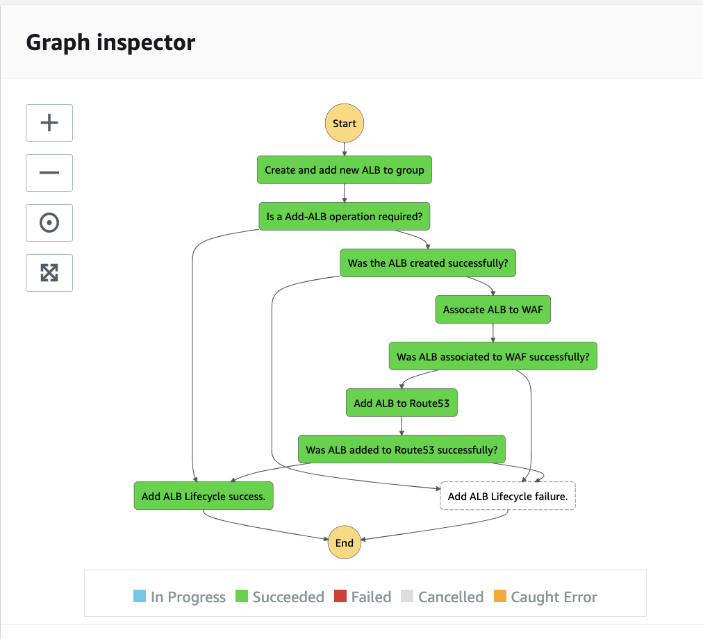
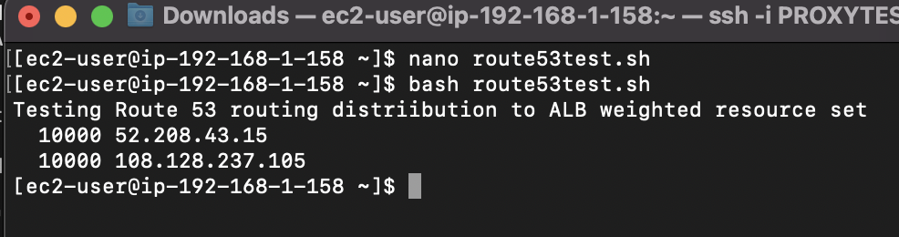
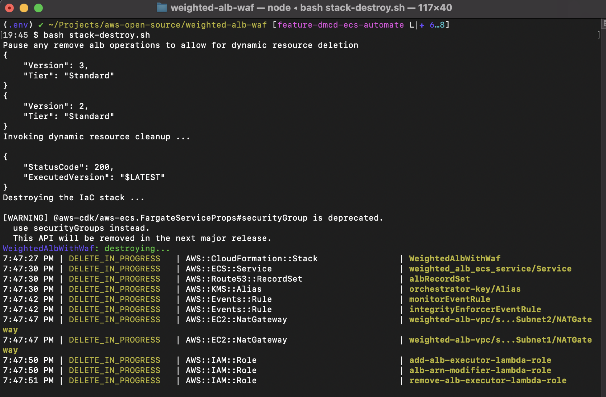

# Weighted Application Loadbalancer Infrastructure protected by WAF

This solution describes a pattern for providing multiple [AWS ALB](https://docs.aws.amazon.com/elasticloadbalancing/latest/application/introduction.html) (Application Load Balancer) instances with layer 7 security protection against common vulnerabilities and exploits, bot control and rate limiting functionality.

The solution achieves these functionalities by leveraging [AWS WAF](https://aws.amazon.com/waf/#:~:text=AWS%20WAF%20is%20a%20web,security%2C%20or%20consume%20excessive%20resources.) (AWS Web Application Firewall).

AWS WAF is a web application firewall that helps protect your web applications or APIs against common web exploits and bots that may affect availability, compromise security, or consume excessive resources. AWS WAF gives you control over how traffic reaches your applications by enabling you to create security rules that control bot traffic and block common attack patterns, such as SQL injection or cross-site scripting. You can also customize rules that filter out specific traffic patterns. You can get started quickly using Managed Rules for AWS WAF, a pre-configured set of rules managed by AWS or AWS Marketplace Sellers to address issues like the OWASP Top 10 security risks and automated bots that consume excess resources, skew metrics, or can cause downtime. These rules are regularly updated as new issues emerge.

The solution includes a [AWS Route 53](https://aws.amazon.com/route53/) hosted zone which allows multiple ALBs to be accessed through a single endpoint address. The ALBs are part of a [weighted resource set](https://docs.aws.amazon.com/Route53/latest/DeveloperGuide/routing-policy.html) which can be configured to distribute different percentages of traffic to specific ALB endpoints. Customers can leverage this Route53 traffic distribution feature to support [Blue/Green deployments](https://docs.aws.amazon.com/whitepapers/latest/overview-deployment-options/bluegreen-deployments.html) and A/B testing.

ALB instances can be added and removed from the [weighted resource set](https://docs.aws.amazon.com/Route53/latest/DeveloperGuide/routing-policy.html) via an automated, event-driven process leveraging [AWS SNS](https://aws.amazon.com/sns/), [AWS Lambda](https://aws.amazon.com/lambda/) and [AWS Step Functions](https://aws.amazon.com/step-functions/).

* [Solution architecture](#solution-architecture)
* [Event-driven automations](#event-driven-automations)
* [Solution notifications](#solution-notifications)
* [AWS WAF configuration](#aws-waf-configuration)
* [Deploying the project](#deploying-the-project)
* [Verifying the project](#verifying-the-project)
* [Testing the project](#testing-the-project)
    * [WAF Protection](#waf-protection)
    * [Route 53 routing](#route-53-routing)
        * [Execute an ALB scale-out operation](#execute-an-alb-scale-out-operation)
        * [Launch an EC2 instance in the project VPC](#launch-an-ec2-instance-in-the-project-vpc)
        * [Execute the Route 53 weighted routing test](#execute-the-route-53-weighted-routing-test) 
    * [Automatic remediation](#automatic-remediation)
* [Clean-up the project](#clean-up-the-project)
* [Executing unit tests](#executing-unit-tests)
* [Executing static code analysis tool](#executing-static-code-analysis-tool)

## Solution architecture

The soluition architecture is described below:



The core services of the solution architecture are referenced below:

| Core service | Description |
|-----------------|:-------------|
| [Route 53](https://aws.amazon.com/route53/) | The purpose of Route 53 in the solution is to provide a single, unified endpoint for the ALB instances which are part of a [Route 53 Weighted Resource Set](https://docs.aws.amazon.com/Route53/latest/DeveloperGuide/routing-policy.html) which provides weighted traffic distribution between multiple ALB instances. |
| [AWS WAF](https://aws.amazon.com/waf/#:~:text=AWS%20WAF%20is%20a%20web,security%2C%20or%20consume%20excessive%20resources.) | The purpose of AWS WAF in the solution is to provide layer 7 security protection against common vulnerabilities and exploits, bot control and rate limiting functionality. |
| [AWS ALB](https://aws.amazon.com/elasticloadbalancing/application-load-balancer/) | In order to use AWS WAF, it must be associated with a valid AWS resource. Valid AWS resources that can be protected by WAF are; an Amazon CloudFront distribution, an Amazon API Gateway REST API, an Application Load Balancer, and an AWS AppSync GraphQL API. Within the context of this solution, AWS ALB will be associated with and protected by AWS WAF. AWS ALB will also forward traffic to a sample application running in AWS ECS Fargate using the default round-robin forwarding algorithm. |

The supporting services of the solution architecture are referenced below:

| Supporting service | Description |
|-----------------|:-------------|
| [AWS Step Functions](https://aws.amazon.com/step-functions/) | AWS Step Functions is a low-code, visual workflow service that developers use to build distributed applications, automate IT and business processes, and build data and machine learning pipelines using AWS services. Workflows manage failures, retries, parallelization, service integrations, and observability so developers can focus on higher-value business logic. AWS Step Function are used within this solution to coordinate the tasks associated with an ALB scale-out or scale-in operation. |
| [AWS Lambda](https://aws.amazon.com/lambda/) | AWS Lambda is a serverless, event-driven compute service that lets you run code for virtually any type of application or backend service without provisioning or managing servers. You can trigger Lambda from over 200 AWS services and software as a service (SaaS) applications, and only pay for what you use. AWS Lambda is used within this solution as the compute service that executes the tasks associated with an ALB scale-out, scale-in or monitoring operations. |
| [AWS SNS (Simple Notification Service)](https://aws.amazon.com/sns/) | Amazon Simple Notification Service (Amazon SNS) is a fully managed messaging service for both application-to-application (A2A) and application-to-person (A2P) communication.. AWS SNS is used within this solution as the messaging service which triggers ALB scale-out and scale-in operations. AWS SNS is also used to send event notifications to topic subscribers. |
| [Amazon ECS (Elastic Container Service)](https://aws.amazon.com/ecs/) | Amazon ECS is a fully managed container orchestration service that helps you easily deploy, manage, and scale containerized applications. It deeply integrates with the rest of the AWS platform to provide a secure and easy-to-use solution for running container workloads. Amazon ECS is used within this solution as the container orhestration service which provides HTTP backend targets for the Front Facing ALBs. |
| [AWS Fargate](https://aws.amazon.com/fargate/) | AWS Fargate is a serverless, pay-as-you-go compute engine that lets you focus on building applications without managing servers. AWS Fargate is compatible with both Amazon Elastic Container Service and Amazon Elastic Kubernetes Service. Amazon ECS is used within this solution as the compute engine which executes the HTTP backend containers. |

## Event-driven automations

As a complement to the solution architecture, an automated and event-driven process is provided which can dynamically add or remove ALB instances to the solution.

The event-driven process that adds ALB instances to the solution is presented below:



1. A message is published to an SNS Topic.
2. The SNS Topic triggers a Lambda function.
3. The Lambda function triggers an [AWS Step Functions State Machine](https://aws.amazon.com/step-functions/).
4. The AWS Step Functions State Machine performs the following tasks (via Lambda functions):
5. Create a new ALB
6. Associates the new ALB to the existing AWS WAF
7. Adds the new ALB DNS record to the Route 53 Weighted Resource Set for the solution

The event-driven process that removes ALB instances from the solution is presented below:


1. A message is published to an SNS Topic.
2. The SNS Topic triggers a Lambda function.
3. The Lambda function triggers an [AWS Step Functions State Machine](https://aws.amazon.com/step-functions/).
4. The AWS Step Functions State Machine performs the following tasks (via Lambda functions):
5. Deletes a dynamically created ALB
6. Disassociates the ALB from the existing AWS WAF
7. Removes the ALB DNS record to the Route 53 Weighted Resource Set for the solution

## Solution notifications

The solution supports notifications via SNS topics.

Notifications come in two flavours:

1. `INFO` notifications for autoscaling lifecycle events
2. `ERROR` notifications which are generated either by errors during an ALB add/remove event or via the Monitor or Integrity Enforcer lambda functions

See the article [Subscribing to an Amazon SNS topic](https://docs.aws.amazon.com/sns/latest/dg/sns-create-subscribe-endpoint-to-topic.html) for details on the protocols supported for SNS topic subscriptions.

## AWS WAF configuration

The solution supports the following WAF rules.

| Rule | Description |
|-----------------|-----------------|
| [AWSManagedRulesCommonRuleSet](https://docs.aws.amazon.com/waf/latest/developerguide/aws-managed-rule-groups-baseline.html#aws-managed-rule-groups-baseline-crs) | This rule group contains rules that are generally applicable to web applications. This provides protection against exploitation of a wide range of vulnerabilities, including many high risk and commonly occurring vulnerabilities described in OWASP publications such as OWASP Top 10. Consider using this rule group for any AWS WAF use case.  |
| [AWSManagedRulesKnownBadInputsRuleSet](https://docs.aws.amazon.com/waf/latest/developerguide/aws-managed-rule-groups-baseline.html#aws-managed-rule-groups-baseline-known-bad-inputs) | The Known bad inputs rule group contains rules to block request patterns that are known to be invalid and are associated with exploitation or discovery of vulnerabilities. This can help reduce the risk of a malicious actor discovering a vulnerable application. |

## Deploying the project

The project code uses the Python flavour of the AWS CDK ([Cloud Development Kit](https://aws.amazon.com/cdk/)). In order to execute the project code, please ensure that you have fulfilled the [AWS CDK Prerequisites for Python](https://docs.aws.amazon.com/cdk/latest/guide/work-with-cdk-python.html).

Additionally, the project assumes the availability of a `bash` (or compatible) shell environment and a `Docker` engine.

The project code requires that the AWS account is [bootstrapped](https://docs.aws.amazon.com/de_de/cdk/latest/guide/bootstrapping.html) in order to allow the deployment of the CDK stack.

```
# navigate to project directory
cd weighted-alb-waf

# install and activate a Python Virtual Environment
python3 -m venv .venv
source .venv/bin/activate

# install dependant libraries
python -m pip install -r requirements.txt

# bootstrap the account to permit CDK deployments
cdk bootstrap
```

Upon successful completion of `cdk bootstrap`, the project is ready to be deployed.

A utility script is available that will execute the `cdk deploy` command.

The script can be executed with the command shown below.

```
bash stack-deploy.sh
```

## Verifying the deployment

Following a successful deployment, verify that two new stacks have been created within the AWS account:

* `CDKToolkit`
* `WeightedAlbWithWaf`

Log into the AWS Console → navigate to the CloudFormation console:



## Testing the project

The solution can be tested from various perspectives.

1. WAF Protection
2. Route 53 routing
3. Automatic remediation

### WAF Protection

The project provides a script that can be executed to test that WAF is protecting the ALB traffic from common exploits.

In order to execute the test script, you will need to obtain the public dns name of the ALB.

Log into the AWS Console → navigate to the EC2 console -> Load Balancing -> Load Balancers.

Find the ALB with the name: `fleet-alb-1` and copy the `DNS name`.



The test script can be executed as shown below.

Don't forget to replace `alb-url.aws-region-1.elb.amazonaws.com` with the DNS name of the `fleet-alb-1` ALB retrieved in the previous step.

```
bash tests/scripts/waf-tests.sh -u http://alb-url.aws-region-1.elb.amazonaws.com"
```

The test script executes the following tests:

| Test | Expectation | Expected HTTP Code |
|-----------------|:-------------|:-------------|
| Safe header parameters| WAF should not block this request as it is does not contain a dangerous payload | 200 OK |
| Localhost header| WAF should block this request as the `localhost` header is not permitted | 403 Forbidden |
| Cross Site Scripting | WAF should block this request as the payload includes a CSS attack | 403 Forbidden |
| Remote Command Execution(RCE) | WAF should block this request as the payload includes a RCE attack | 403 Forbidden |
|  Log4j vulnerability | WAF should block this request as the payload an attempt to exploit a  Log4j vulnerability | 403 Forbidden |

### Route 53 routing

The project provides a script that allows you to test Route 53 weighted routing between multiple ALB backend targets.

In order to execute this script, two prerequisites need to be completed:

1. Execute an ALB scale-out operation which will add the new ALB to the Route 53 weighted resource set.
2. Launch an EC2 instance in the project VPC. An *internal* VPC bound EC2 instance is requires to test Route 53 routing as the project creates a private hosted zone that is not available from outside the VPC.

### Execute an ALB scale-out operation

An ALB scale-out operation can be executed via the script below:

```
bash execute-add-alb-operation.sh
```

The final output of the `execute-add-alb-operation.sh` deployment script includes the ARN for the State Machine that performs the Add ALB operation.



To check the AWS State Machine, log into the AWS Console → navigate to the Step Functions console. You can search for the State Machine via the `State Machine Arn` value which was displayed by the `execute-add-alb-operation.sh` script.

Click on the discovered State Machine and then click on the execution that is in the `Running` state to see the Graph Inspector diagram which shows the progress of the State Machine through its tasks.

The State Machine has successfully completed its tasks when all nodes of the graph are green (as shown in the example below).



If you wish to perform additional verifications, you could check:

1. EC2 console to verify that a new ALB has been added
2. WAF & Shield console to verify that the new ALB has been associated to WAF
3. Route 53 console to verify that a new ALB has been added to the Private Hosted Zone (`weightedalbwithwaf.internal`)

#### Launch an EC2 instance in the project VPC

Detailed instructions for launching and connecting to Linux EC2 instances are provided below.

Two key points to remember:

1. Use an Amazon Linux 2 AMI (`t2.micro` instance type is sufficient)
2. Add the EC2 instance to a *Public* subnet in the `WeightedAlbWithWaf/weighted-alb-vpc` VPC

* [Launch EC2 instances](https://docs.aws.amazon.com/AWSEC2/latest/UserGuide/LaunchingAndUsingInstances.html)
* [Connect to EC2 instances](https://docs.aws.amazon.com/AWSEC2/latest/UserGuide/AccessingInstances.html)

#### Execute the Route 53 weighted routing test

1. Connect to the EC2 instance created in the previous step
2. Create a new text document; `nano route53test.sh`
3. Copy the contents of the script below into the `route53test.sh` file

```
#!/bin/bash
echo "Testing Route 53 routing distriibution to ALB weighted resource set"
for i in {1..10000}
do
    domain=$(dig alb.weightedalbwithwaf.internal A @169.254.169.253 +short)
    echo -e  "$domain" >> RecursiveResolver_results.txt
done

cat RecursiveResolver_results.txt | tr '[:space:]' '[\n*]' | grep -v "^\s*$" | sort | uniq -c | sort -bnr
```

4. Run the script; `bash route53test.sh`
5. Once completed (it will take several minutes), the script will output the distribution of requests between the ALB targets of the weighted resource set



### Automatic remediation

The project includes a [monitor](stacks/weighted_alb_with_waf/resources/lambda/orchestrator/app/monitor) package that is composed of a [Monitor](stacks/weighted_alb_with_waf/resources/lambda/orchestrator/app/monitor/monitor.py) lambda and an [Integrity Enforcer](stacks/weighted_alb_with_waf/resources/lambda/orchestrator/app/monitor/integrity_enforcer.py) lambda.

These two lambdas execute according to a regular [CloudWatch Events schedule](https://docs.aws.amazon.com/AmazonCloudWatch/latest/events/WhatIsCloudWatchEvents.html) and will attept to remediate misconfigurations within the project.

You can test this functionality by performing any of the following actions:

1. Delete an ALB (an alb with name `fleet-alb-XXX`)
2. Remove an ALB association from WAF (an alb with name `fleet-alb-XXX`)
3. Delete an ALB record from the Route53 Private Hosted Zone (`weightedalbwithwaf.internal`)

Once the resource has been deleted, wait for up to 2 minutes and you should see that the deletion action has been remediated and the resource has been recreated.

# Clean-up the project

Project clean-up is a 2 step process:

1. Destroy the CDK stack and associated dynamic resources.
2. Delete the *CDKToolkit* stack from CloudFormation.

The CDK stack and associated dynamic resources can be destroyed with the command below:

```
bash stack-destroy.sh
```



When the `stack-destroy.sh` script has completed (it will take several minutes), the final clean-up task is to delete the CDKToolkit CloudFormation stack.

1. Log into the AWS Console → navigate to the *CloudFormation* console.
2. Navigate to *Stacks*.
3. Select the **CDKToolkit**.
4. Click the *Delete* button.

## Executing unit tests

Unit tests for the project can be executed via the commands below:

```bash
python3 -m venv .venv
source .venv/bin/activate
cdk synth && python -m pytest -v -c ./tests/pytest.ini
```

## Executing static code analysis tool

The solution includes [Checkov](https://github.com/bridgecrewio/checkov) which is a static code analysis tool for infrastructure as code (IaC).

The static code analysis tool for the project can be executed via the commands below:

```bash
python3 -m venv .venv
source .venv/bin/activate
cdk synth && checkov --config-file checkov.yaml
```

**NOTE:** The Checkov tool has been configured to skip certain checks.

The Checkov configuration file, [checkov.yaml](checkov.yaml), contains a section named `skip-check`.

```
skip-check:
  - CKV_AWS_2 # Ensure ALB protocol is HTTPS"
  - CKV_AWS_65 # Ensure container insights are enabled on ECS cluster
  - CKV_AWS_66 # Ensure that CloudWatch Log Group specifies retention days
  - CKV_AWS_91 # Ensure the ELBv2 (Application/Network) has access logging enabled
  - CKV_AWS_103 # Ensure that Application Load Balancer Listener is using TLS v1.2
  - CKV_AWS_107 # Ensure IAM policies does not allow credentials exposure
  - CKV_AWS_111 # Ensure IAM policies does not allow write access without constraints
  - CKV_AWS_116 # Ensure that AWS Lambda function is configured for a Dead Letter Queue(DLQ)
  - CKV_AWS_131 # Ensure that ALB drops HTTP headers
  - CKV_AWS_158 # Ensure that CloudWatch Log Group is encrypted by KMS
  - CKV_AWS_173 # Check encryption settings for Lambda environmental variable
```

These checks represent best practices in AWS and should be enabled (or at the very least the security risk of not enabling the checks should be accepted and understood) for production systems. 

In the context of this solution, these specific checks have not been remediated in order to focus on the core elements of the solution.